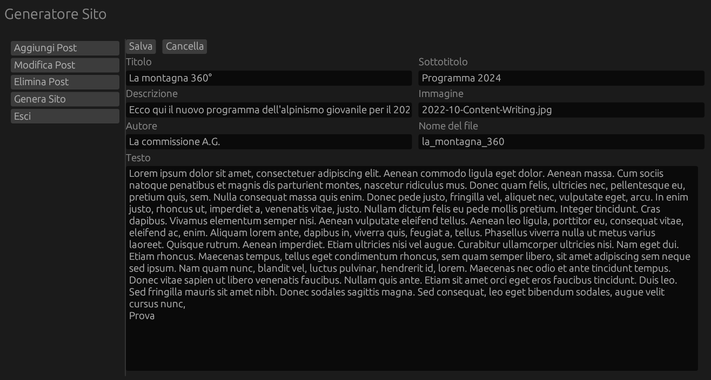

# Markdown blog in Rust

Visit the site: https://san7o.github.io/rust-ag-blog/site/

This is my personal Rust toolchain for managing a static markdown blog. For each markdown blog post, the toolchain will parse it to html and yaml, a new post page will be created from an html template made in wordpress. Additionally, a page with all the posts will be created.

# GUI

The toolchain comes with a fully-working GUI made with [eGUI](https://github.com/emilk/egui/tree/master?tab=readme-ov-file)

## What I used:
- [Markdown](https://github.com/wooorm/markdown-rs) to parse the markdown files into html
- [Tera](https://github.com/Keats/tera) template engine to insert html to a template file
- [yaml-rust](https://github.com/chyh1990/yaml-rust) to parse Yaml data
- [egui](https://github.com/emilk/egui) for the GUI interface
- [rfd](https://github.com/PolyMeilex/rfd) to open file picker window
- Local installation with [WordPress](https://github.com/WordPress/WordPress) to generate the templates
  - Thanks to [Elementor](https://it.wordpress.org/plugins/elementor/) editor and [Export WP page to html](https://wordpress.org/plugins/export-wp-page-to-static-html/).

## Structure:
- `posts/`         -> .md post files
- `site/`          -> the main public site 
  - `blog/`        -> the main blog page
  - `post/`        -> all the posts' html 
  - `index.html`   -> the main site index 
- `src/`           -> the source code
- `templates/`     -> templates folder    
  - `blog.html`    -> custom template for the blog page  
  - `post.html`    -> custom template for a post
  - `md_post.md` -> the template for an md post
 

## Must have yaml tags 
In every post file there `must` exist a yaml tag for each of the following:
- `filename`: Short string without spaces, the html file will be named after this
- `title`: The main title displayed
- `subtitle`: Will be displayed under the title 
- `description`: A summary of the blog content, will be displayed in the blog page
- `image`: the name of the image (with the file type), the image must be in the site/blog/images/ directory
- `author`: Author name
- `"BEGIN DOCUMENT"` keyword after the tags: to divide tags section from the blog content section

## Recommendations
Use .jpg images or any compressed format (not .png)

## Development
- [x] Markdown to Html 
- [x] Html to Template 
- [x] Support for yaml tags
- [x] Decent templates
- [x] Link MD to templates
- [x] Post page 
- [x] Blog Page
- [x] Buttons connected
- [x] Images from png to jpg
- [x] GUI
  - [x] Genera Sito 
  - [x] Aggiungi Post 
  - [x] Modifica Post 
  - [x] Rimuovi Post

## Pagine
- [ ] Chi siamo
- [ ] La montagna sottosopra
- [ ] La montagna a 360°
